# Some basic Network Protocols for CyberSecurity 🕵️

## Overview 🔍

I'm not sure if I should call this a project, a research piece, or a blog post @@. It's look like a dictionary!!!. The main purpose of me making it is to supplement as well as strengthen the foundation of basic network protocols to understand thoroughly and correctly serve the development towards CyberSecurity. 😉

I will build it as a Dictionary grasp the basics of Network so whenever I forget anything, I can look it up 😚

## Table of Contents 📖

**[1. IP Adress](#1-ip-adress)**

**[2. Public and Private IP Adress](#2public-and-private-ip-adrress)**

**[3. IP, TCP and UDP](#3ip-tcp-and-udp)**

**[4. ARP and DNS](#4-arp-and-dns)**

**[5. FTP, SMB and SMTP](#5-ftp-smb-and-smtp)**

**[6. SNMP and Telnet](#6-snmp-and-telnet)**

**[7. HTTP](#7-http)**

## Let's Start 🔥

### 1/ IP Adress
Internet Protocols are like the backbone of digital world. They allow us to do things like sending emails, Watching Youtube videos, chatting on Facebook, browsing Webs, ...

The digital devices we have and are using, such as laptops, phones, PCs, tablets, ..., are all assigned with an IP address. This address enables devicess to communicate and connect with each other. Think of it like your home address, you wouldn't be able to find the house to send mail to it if you didn't know the address.

### 2/Public and Private IP adrress

**<u>LAN (Local Area Network)</u>**

IP addresses do have a limitation. There are not enough IP adrresses to cover all devices that need to connect to the internet.

The current IP system (IPv4) has only 4.3 billion addresses, while the global population is over 8 billion people, and each person often uses multiple devices simultaneously.

To address this problem, a system was developed to reuse a group of IP addresses within a local area network (LAN) which are not accessible over the Internet. These addresses can be used repeatedly within each local network helping conserve the limited number of IP address available.

These private addresses typically start:

| From        | - |  To                 |
|-------------|---|---------------------|
| 192.168.0.0 | - | 192.168.255.255     |
| 10.0.0.0    | - | 10.255.255.255      |
| 172.16.0.0  | - | 172.16.255.255      |

You can check your address with command **ifconfig** for Kali-linux or **ipconfig** for Windows.

**<u>NAT (Network Address Translation)</u>**

These addresses are only available within your local area network and can not be use to communicate over the Internet directly since they are not unique.

For Internet, your private Ip address need to be translated into a public Ip address by a Network Address Translation (NAT)

NAT allows devices within your local network to access the Internet using a shared public Ip adrress. 

When a machine inside a LAN wants to communicate over the Internet, it sends a request to the NAT device. The NAT device then records the internal IP address of the machine in a table and converts it to the external IP address of the router. When the response packet returns from its destination on the Internet, the NAT device check its table and forwards the packet to the internal IP address of the original machine within the LAN.  

**<u>DHCP (Dynamic Host Configuration Protocol)</u>**

The protocol dynamically assigns IP address. Instead of having a fixed IP address all the time, device gets a new IP address each time it connects to a network. DHCP commonly used on LAN where private IP addresses are used. 

When a device joins a LAN, it sends a request to the DHCP server asking for an IP address. The DHCP server then assign IP address to that device for a specific period known as a "lease". This "lease" defines how long device can use particular IP address.

This dynamic allocation of IP addresses helps manage and optimize the use of available IP addresses within the newtork.

### 3/IP, TCP and UDP

IP is like a travel guide for data packets on the Internet. It helps these packets know where to go to destination and where they are coming from the source.

It's often paired up with other protocols like TCP to form what's commonly known as TCP/IP.

Let's see what's inside an IP packet header.

In the first row:
- Version: Which version of IP is being used, either v4 or v6.
- IHL (Interner Header Length): The length of the header.
- Type of Service: Describe the packet service type, like if it's focused on speed, reliability or cost effectiveness.
- Total Length: The overall size of packet including its data.

In the second row:
- Identification: Unique ID of each packet.
- Flags: If the packet is split into smaller parts or not.
- Fragment Offset: If a packet is split, this field tells us where it starts in the sequence.

In the 4th row:
- Source Address: Where the packet is coming from.

In the 5th row:
- Destination Address: Where the packet is coming to.

In the 6th row:
- Options: It's optional => so, not need to care about it :D
- Padding: If needed, this part fills in any extra space in the header.

**<u>TCP</u>**

In the first row:
- Source Port Number: What port coming from.
- Destination Port Number: what port coming to.

In the second row:
- Sequence Number: This number is generated by the sender's TCP stack. It ensures that packets are arranged in the correct order when they arrive.

In the third row:
- Acknowledgement Number: This echoes back the sequence number confirming that the package has been received. If no acknowledgement is received within a set time, the sender resends the packets to ensure successful delivery.

In the 4th row:
- SYN: Initiates a new connection.
- FIN: Signals the normal closing of a connection.
- ACK: Acknowledges receipt of a packet, crucial after the three-way handshake.
- RST: Indicates a hard-close of a connection, often used to communicate errors.
- URG: Marks urgent data in the packet.
- PSH: Directs the data past the buffer to the application.
- Window Size: Manage packet buffering adding in flow control.

In the 5th row:
- TCP Checksum: Ensure data Integrity.
- Urgent Pointer: Indicate urgent data if the URG flag is set.

In the 6th row:
- Options: Allowing for additional information and aligning the TCP header to a multiple of 32 bits.

Every TCP start with a three-way handshake.

**<u>UDP (User Datagram Protocol)</u>**

UDP is the opposite counterpart of TCP.

While TCP is all about establishing a solid connection (like a handshake) and ensure every piece of data gets delivered, UDP is not. 

Unlike TCP, UDP do not requires a formal connection setup, it just sends packets out into the world without worrying about getting a confirmation of delivery. Because UDP skips the whole connection assurance process, it's lighter and faster than TCP. This makes it perfect for applications requiring real-time and losing occasional packet isn't a big deal.

Some of the key protocols that use UDP include DNS, SNMP, NTP.

### 4/ ARP and DNS

**<u>ARP (Address Resolution Protocol)</u>**

Is like a translator for devices on an Ethernet Network. Its job is to match up IP addresses which are logical with Mac addresses which are physical.

[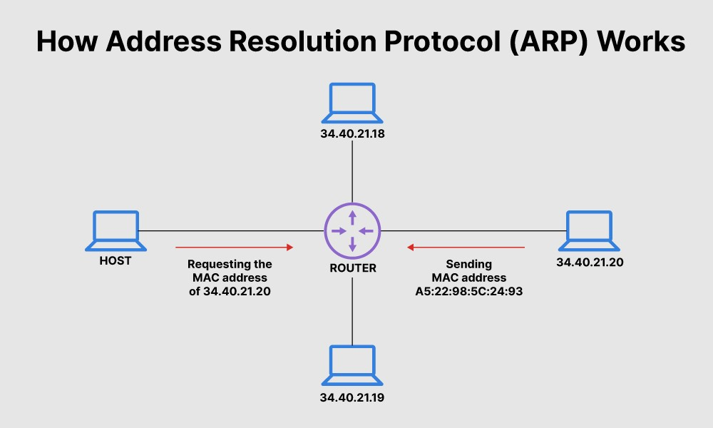](image/ARP.png)

This way, when a new device joins the network ARP assign an IP address within the Network's range and links it to its unique Mac address.

How ARP works? It's very simple 👇

[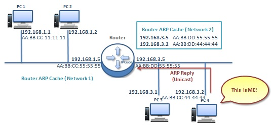](image/ARP_Work.png)

Assume that comp1 (computer 1) knows about IP of comp2 (computer 2) and comp1 wants to send packet to comp2. First, comp1 come to check ARP table.

[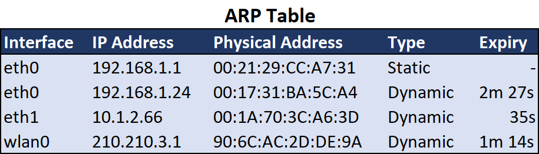](image/ARP_Table.png)

Here are two scenarios:
- In scenario 1, when the IP of comp2 is found, comp1 will retrieve its corresponding MAC and send the packet to that MAC address.
- In scenario 2, if comp2's IP is not found, comp1 will send a broadcast packet. Comp2 will detect the broadcast packet and respond with its MAC address. Then, comp1 will send the packet to comp2's MAC address.

ARP is also a potential target for attackers.

[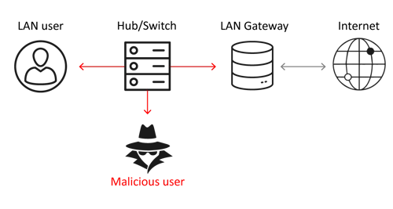](image/ARP_Spoof.png)

**<u>DNS (Domain Name System)</u>**

It is very simple protocol but plays a very important role!!!

Without DNS, we must to remember every IP address of website that we want to access 😖

DNS translates domain name ( human language) into IP addresses (internet routing language)

DNS has come a long way in temrs of security but it used to be quite fragile and susceptible to attacks. 

One type of common attack involves havesting information from DNS servers on the target Network by DNS scanning and DNS reconnaisance. Attackers can gather valuable data from DN servers such as domain names and associated IP addresses which can be used for further exploitation.

On LAN, attackers may exploit DNS vulnerabilities by spoofing DNS responses using tools DNS spoof. This allows them to redirect client message to a malicious local system controlled by the attackers.

[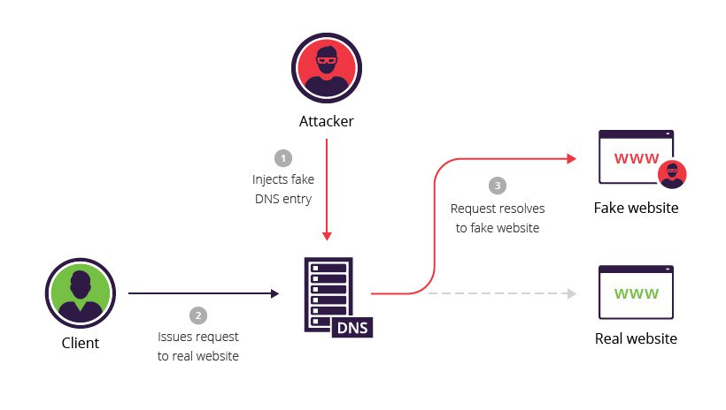](image/DNS_Spoof.png)

### 5/ FTP, SMB and SMTP

**<u>FTP (File Transfer Protocol)</u>**

Is a client-server protocol used for transferring files over a network.

FTP follows a client-server architecture where a client such as a computer or device request files from a server and server provides the requested files. 

[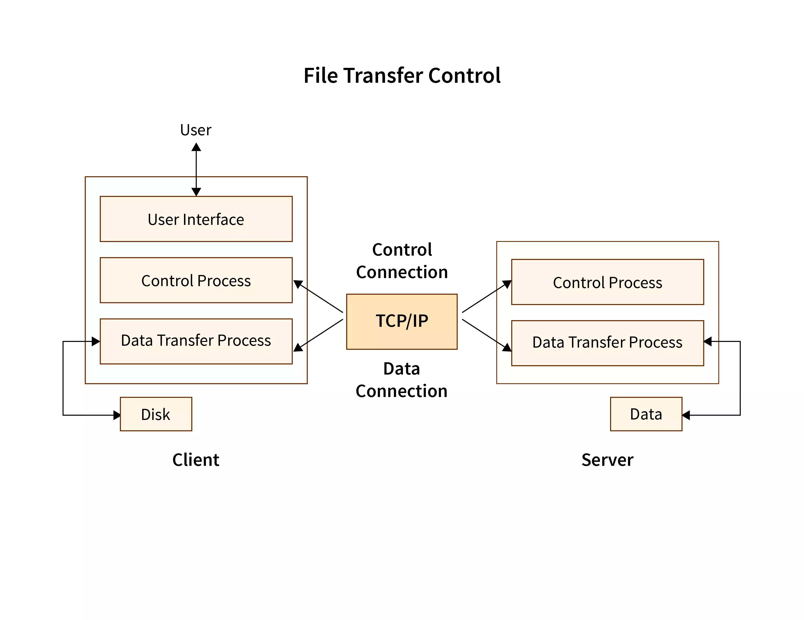](image/FTP_TCP.png)

FTP operates on the TCP/IP protocols, ensuring reliable data transmission across networks. 

FTP use 2 channel for communication:
- Command Channel: used by the client to send commands to the server, such as requesting files or directories.
- Data channel: used for actual file transfers. When a client requests a file, the server opens a data channel to transfer the file to the client. Client can perform various actions on files using FTP including downloading, uploading, editing, copying and deleting, ...  

FTP was widely used in the past for file sharing and management, its popularity has decreased with the rise of HTTP for file transfers especially for public file sharing on the web. However, FTP remains a common protocol for private and secure file sharing such as in banking system or other environments where data security and privacy are paramount.

**<u>SMB (Server Message Block)</u>**

It's a communication method that computers use to share files, printers and other resources over a local network. 

Think of it as a way for computers to talk to each other and share stuff. When you use SMB, one computer acts as the server that has the files or printers others want to access while the other computers are the cliensts that want to get those files or use the printers.

[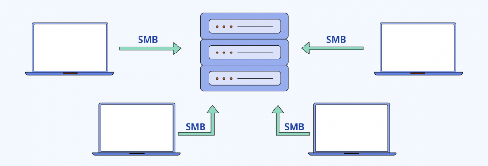](image/SMB_Protocols.png)

Here's how it works in simple steps. 

Client computers connect to servers-other computers using TCP/IP which are just way for computers to talk to each other over a network. Once connected, clients can send commands to the server to access shared folders where files are stored to read or write files or even use shared printers. Basically, SMB lets you do on your computer what you normally do like accessing files or printing but over the network, so you can share things with others on the same network.

SMB in Windows has historically been significant sources of critical vulnerabilities and this trends is likely to continue in the future. Over the past decade, there has been several critical vulnerabilities related to SMB and Windows.

**<u>SMTP (Simple Mail Transport Protocol)</u>**

SMTP is to move emails from one user to another. Even though SMTP was first standardized back in 1983, it's still the fundamental protocol used for sending emails today.

[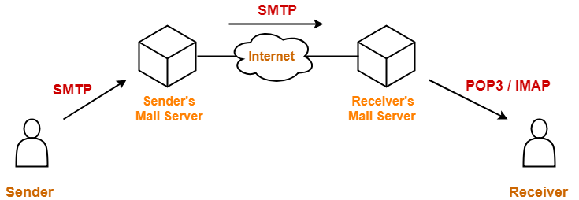](image/SMTP.png)

In simple term, SMTP acts as the postal service of the Internet, ensuring that your emails get delivered.

### 6/ SNMP and Telnet

**<u>SNMP (Simple Network Management Protocol)</u>**

SNMP is designed specifically for managing computers and network devices.

[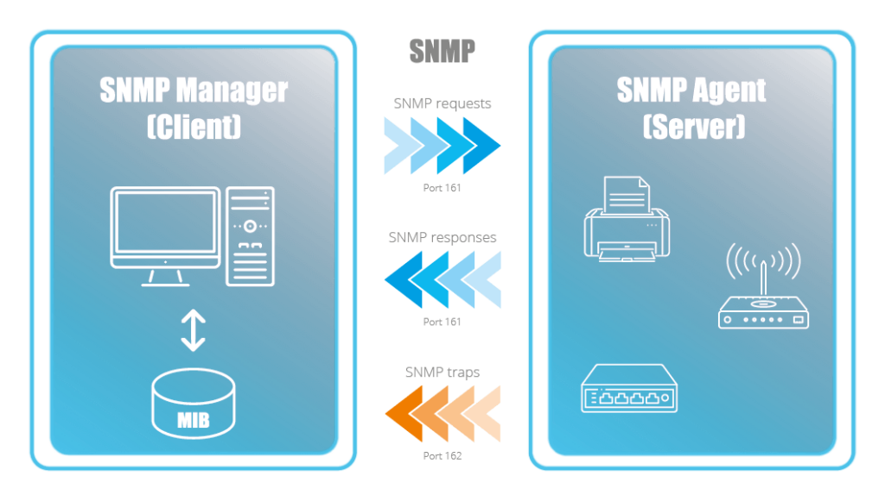](image/SNMP.png)

In simple term, SNMP allows computers and network devices to communicate and share information with each other. It's like a system of Administrators managers keeping an eye on a group of computers or devices agents to ensure everything runs smoothly.

Indeed, SNMP is often overlooked but plays a crucial role in maintaining a smoothly functioning network.

However, its importance also makes it a prime target for attackers. If an attacker manages to breach SNMP, they gain access to a wealth of information about your network. They can potentially decrypt encrypted VPN communications, allowing them to eases drop on sensitive data being transmitted. Additionally, they can view and manipulate every device connected to your network. SNMP operates on UDP ports 161 and 162 enabling network devices to communicate with each other and allowing administrators to manage and monitor these devices. 

However, in the wrong hands. SNMP access can lead to disastrous consequences. Attackers could harvest sensitive information disrupt network operations or even take control of critical devices like routers and switches causing widespread Havoc.

**<u>Telnet</u>** 

Telnet is designed for remote connectivity. 

Telnet allows user to establish connections between a remote endpoint and a host machine to initiate a remote session. When a connection is establised, Telnet prompts the user at the remote endpoint to log in. Once authenticated, Telnet grants the endpoint access to network resources and data located on the host computer.

[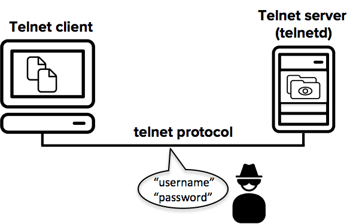](image/Telnet.png)

Originating from the 1960s, Telnet can be considered one of the earliest versions of remote communication protocols used in the development of the modern internet. Howerver, due to its lack of robust security features suitable for contemporary technology and communications, Telnet is no longer widely used. 

The main reason for Telnet's declining usage is its vulnerability to security threats. Telnet transmits data including login credentials in plain text making it susceptible to interception by malicious actors. 

Consequently modern secure protocols such as SSH (Secure Shell) have largely replace Telnet for remote access due to their enhanced security features such as encryption and stronger authentication mechanism.

[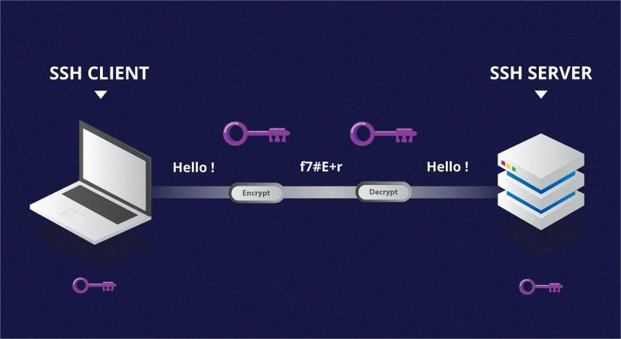](image/SSH.png)

### 7/ HTTP

**<u>HTTP (Hyper Text Transfer Protocol)</u>**

HTTP is a foundational technology of the Internet. HTTP serving as the primary communication protocol for web applications.

Originally designed for retrieving static web pages, HTTP has evolved over time to support complex web applications that we commonly use today. 

[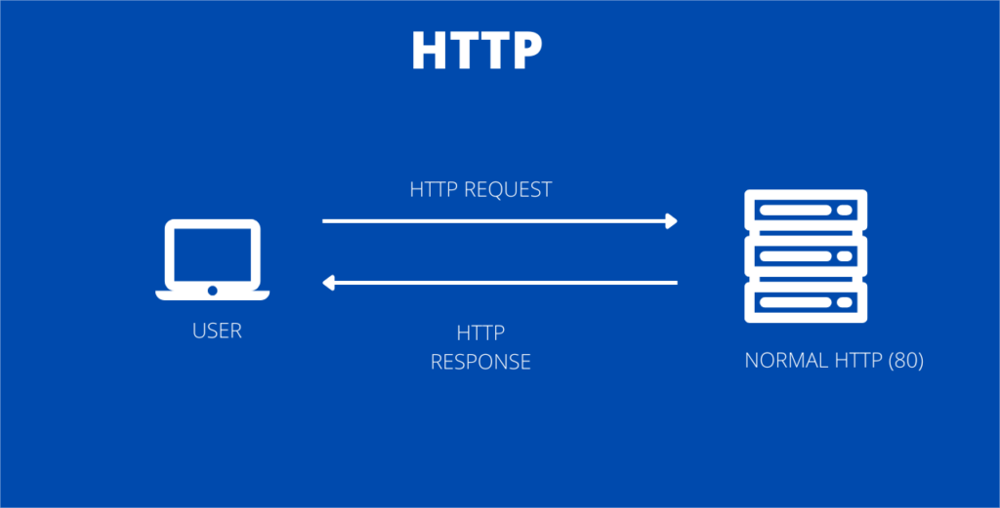](image/HTTP.png)

HTTP operates on a messages-based model, where a client sends a request to a server and the server responds with a corresponding response. 

It's important to note that HTTP is connectionless, meaning that a connection is established and closed for each request response cycle. However, it uses TCP transmission control protocol as its  underlying transport mechanism for reliable data transmission. In essence, HTTP is the backbone enables seamless communication between clients such as web browsers and servers facilitating the transfer of web pages data and multimedia content across the internet.

## End ??

No, it's not the end yet. During the learning and researching process, I will continue to update the knowledge into this repository with the hope that it will become a dictionary for myself whenever I forget.

𝓣𝓱𝓪𝓷𝓴𝓼 𝓯𝓸𝓻 𝓡𝓮𝓪𝓭𝓲𝓷𝓰 💓 