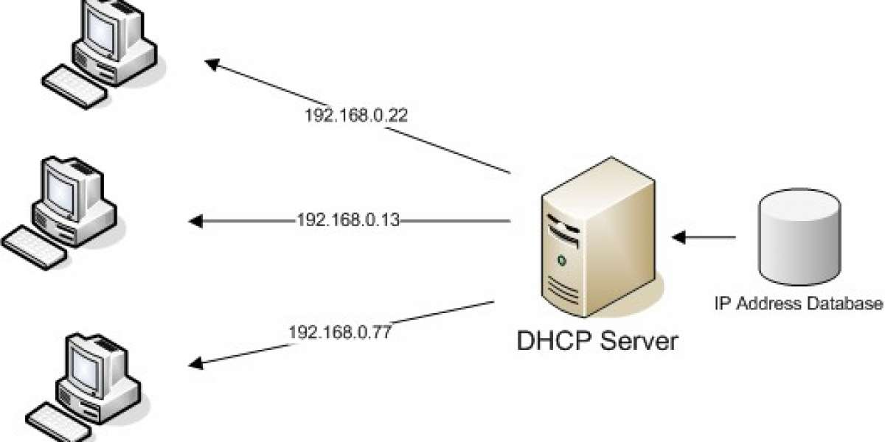

# Some basic Network Protocols for CyberSecurity 🕵️

## Overview 🔍

I'm not sure if I should call this a project, a research piece, or a blog post @@. It's look like a dictionary!!!. The main purpose of me making it is to supplement as well as strengthen the foundation of basic network protocols to understand thoroughly and correctly serve the development towards CyberSecurity. 😉

## Table of Contents 📖

## Let's Start 🔥

### 1/ IP Adress
Internet Protocols are like the backbone of digital world. They allow us to do things like sending emails, Watching Youtube videos, chatting on Facebook, browsing Webs, ...

The digital devices we have and are using, such as laptops, phones, PCs, tablets, etc., are all assigned with an IP address. This address enables devicess to communicate and connect with each other. Think of it like your home address, you wouldn't be able to find the house to send mail to it if you didn't know the address.

### 2/Public and Private IP adrress

**<u>LAN (Local Area Network)</u>**

IP addresses do have a limitation. There are not enough IP adrresses to cover all devices that need to connect to the internet.

The current IP system (IPv4)has only 4.3 billion addresses, while the global population is over 8 billion people, and each person often uses multiple devices simultaneously.

To address this problem, a system was developed to reuse a group of IP addresses within a local area network (LAN) which are not accessible over the Internet. These addresses can be used repeatedly within each local network helping conserve the limited number of IP address available.

These private addresses typically start:

| From        | - |  To                 |
|-------------|---|---------------------|
| 192.168.0.0 | - | 192.168.255.255     |
| 10.0.0.0    | - | 10.255.255.255      |
| 172.16.0.0  | - | 172.16.255.255      |

You can check your address with command **ifconfig** for Kali-linux or **ipconfig** for Windows.

**<u>NAT (Network Address Translation)</u>**

These addresses are only available within your local area network and can not be use to communicate over the Internet directly since they are not unique.

For internet, your private Ip address need to be translated into a public Ip address by a Network Address Translation (NAT)

NAT allows devices within your local network to access the Internet using a shared public Ip adrress. 

When a machine inside a LAN wants to communicate over the Internet, it sends a request to the NAT device. The NAT device then records the internal IP address of the machine in a table and converts it to the external IP address of the router. When the response packet returns from its destination on the Internet, the NAT device check its table and forwards the packet to the internal IP address of the original machine within the LAN.  

**<u>DHCP (Dynamic Host Configuration Protocol)</u>**

The protocol dynamically assigns IP address. Instead of having a fixed IP address all the time, your device get a new IP address each time it connects to a net work.DHCP commonly used on LAN where private IP addresses are used. 

When a device joins a LAN, it sends a request to the DHCP server asking for an IP address. The DHCP server then assign IP address to that devvice for a specific period known as a "lease". This "lease" defines how long device can use particular IP address.

This dynamic allocation of IP addresses helps manage and optimize the use of available IP addresses within the newtork.

## 3/IP (Internet Protocl)

IP is like a travel guide for data packets on the Internet. It helps these packets know where to go to destination and where they are coming from the source.

It's often paired up with other protocols like TCP to form what's commonly known as TCP/IP.

Let's see what's inside an IP packet header.

In the first row:
- Version: Which version of IP is being used, either v4 or v6.
- IHL (Interner Header Length): The length of the header.
- Type of Service: Describe the packet service type, like if it's focused on speed, reliability or cost effectiveness.
- Total Length: The overall size of packet including its data.

In the second row:
- Identification: Unique ID of each packet.
- Flags: If the packet is split into smaller parts or not.
- Fragment Offset: If a packet is split, this field tells us where it starts in the sequence.

In the 4th row:
- Source Address: Where the packet is coming from.

In the 5th row:
- Destination Address: Where the packet is coming to.

In the 6th row:
- Options: It's optional => so, not need to care about it :D
- Padding: If needed, this part fills in any extra space in the header.

**<u>TCP</u>**

In the first row:
- Source Port Number: What port coming from.
- Destination Port Number: what port coming to.

In the second row:
- Sequence Number: This number is generated by the sender's TCP stack. It ensures that packets are arranged in the correct order when they arrive

In the third row:
- Acknowledgement Number: